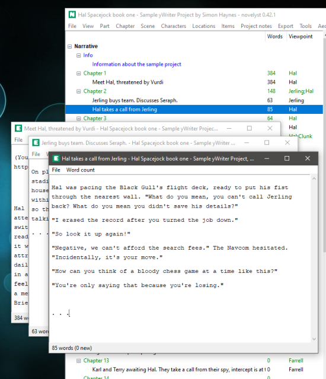

The [novelyst](https://peter88213.github.io/novelyst/) Python program provides a tree view with parts, chapters and scenes for [yWriter](http://spacejock.com/yWriter7.html) projects. 

*novelyst_editor* is a plugin providing a scene editor. 

## Features

- A simple text editor box without rich text display and search capability.
- Text is edited at the "raw markup" level. Markup tags are displayed as stored in the *yw7* file. Formatting tags are similar to those of HTML, but square brackets are used instead of pointed brackets.
- Multiple scene editor windows.
- Word count is displayed and updated either live or on demand.
- The application is ready for internationalization with GNU gettext. A German localization is provided. 
- Editor features:
    - Text selection
    - Copy/Cut/Paste to/from the clipboard
    - Undo/Redo
    - Key shortcuts for bold and italic formatting

## Requirements

- [Python 3.6+](https://www.python.org). 
- Tk support for Python. This is usually part of the Windows Python installation, but may need to be installed additionally under Linux.
- [novelyst](https://peter88213.github.io/novelyst/) version 0.14.1+

## Download and install

[Download the latest release (version 0.14.0)](https://github.com/peter88213/novelyst_editor/raw/main/dist/novelyst_editor_v0.14.0.zip)

- Unzip the downloaded zipfile "novelyst_editor_v0.14.0.zip" into a new folder.
- Move into this new folder and launch **setup.pyw**. This installs the application for the local user.
- Open "README.md" for usage instructions.

### Note for Linux users

Please make sure that your Python3 installation has the *tkinter* module. On Ubuntu, for example, it is not available out of the box and must be installed via a separate package. 

------------------------------------------------------------------

[Changelog](changelog)

## Usage

See the [instructions for use](usage)

## License

novelyst_editor is distributed under the [MIT License](http://www.opensource.org/licenses/mit-license.php).
