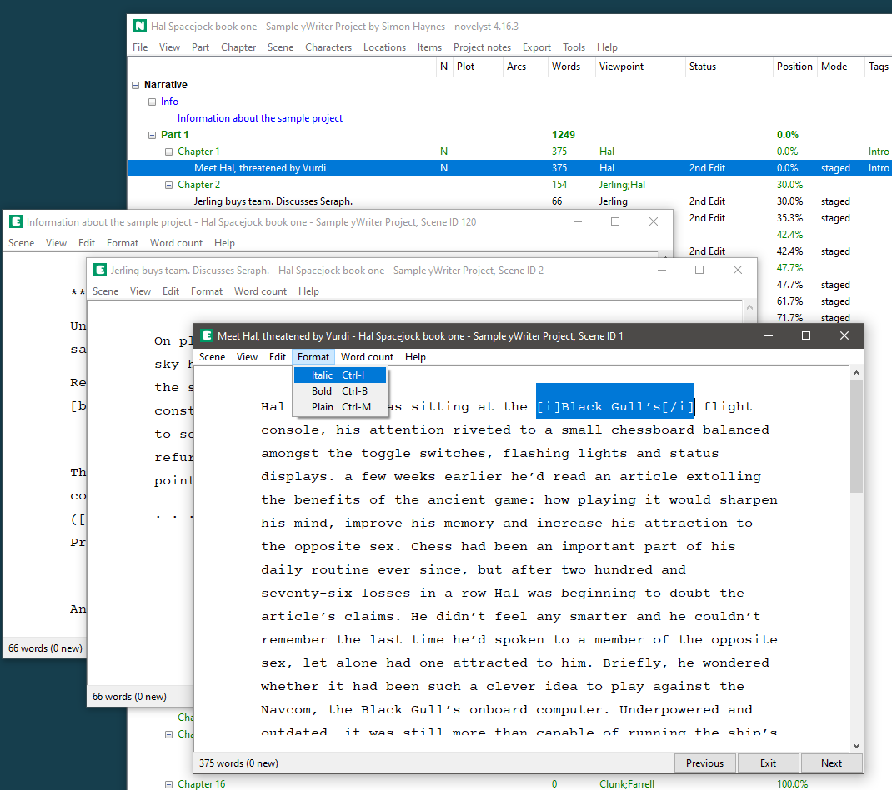

# novelyst_editor

The [novelyst](https://peter88213.github.io/novelyst/) Python program helps authors organize novels.  

*novelyst_editor* is a plugin providing a "plain text" scene editor. 

## Features

- A simple text editor box without rich text display and search capability.
- Text is edited at the "raw markup" level. Markup tags are displayed as stored in the *yw7* file. Formatting tags are similar to those of HTML, but square brackets are used instead of pointed brackets.
- Multiple scene editor windows.
- Word count is displayed and updated either live or on demand.
- The application is ready for internationalization with GNU gettext. A German localization is provided. 
- Editor features:
    - Text selection.
    - Copy/Cut/Paste to/from the clipboard.
    - Undo/Redo.
    - Key shortcuts for bold and italic formatting.
    - Split the scene at the cursor position.
    - Navigation to the next or previous scene.
    
## Requirements

- [novelyst](https://peter88213.github.io/novelyst/) version 4.0+

## Download and install

[Download the latest release (version 4.4.2)](https://github.com/peter88213/novelyst_editor/raw/main/dist/novelyst_editor_v4.4.2.zip)

- Unzip the downloaded zipfile "novelyst_editor_v4.4.2.zip" into a new folder.
- Move into this new folder and launch **setup.pyw**. This installs the application for the local user.
- Open "README.md" for usage instructions.

### Note for Linux users

Please make sure that your Python3 installation has the *tkinter* module. On Ubuntu, for example, it is not available out of the box and must be installed via a separate package. 

------------------------------------------------------------------

[Changelog](changelog)

## Usage

See the [instructions for use](usage)

## License

This is Open Source software, and the *novelyst_editor* plugin is licenced under GPLv3. See the
[GNU General Public License website](https://www.gnu.org/licenses/gpl-3.0.en.html) for more
details, or consult the [LICENSE](https://github.com/peter88213/novelyst_editor/blob/main/LICENSE) file.
